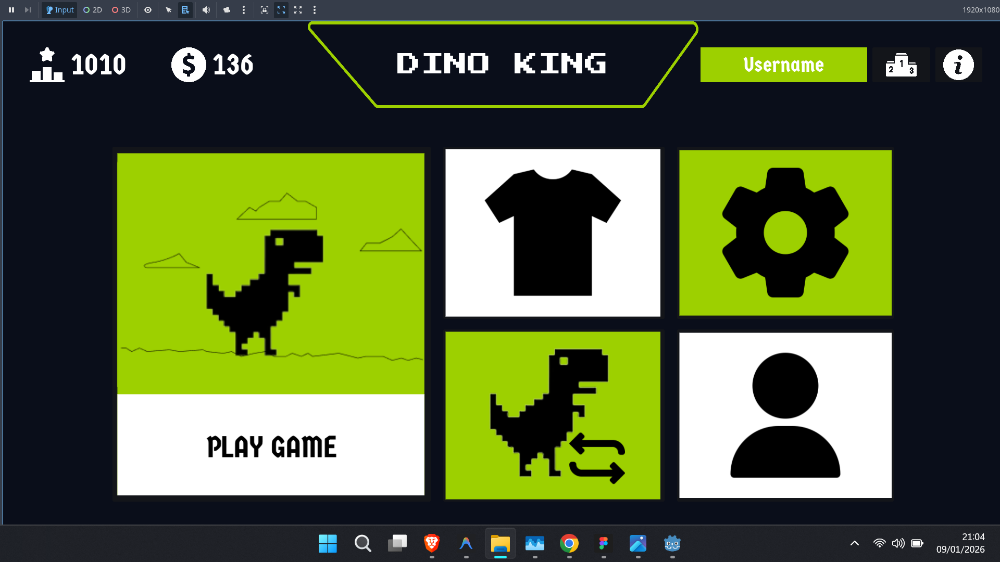
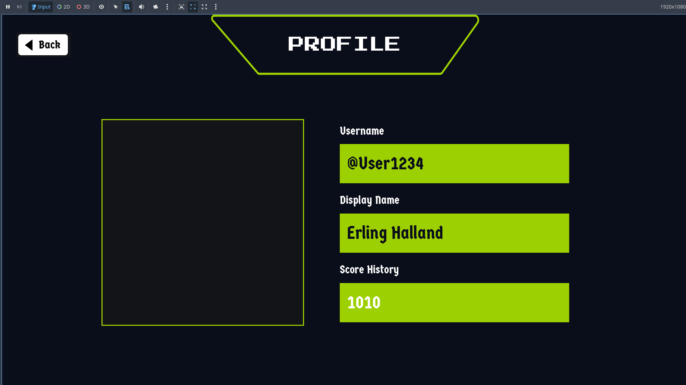
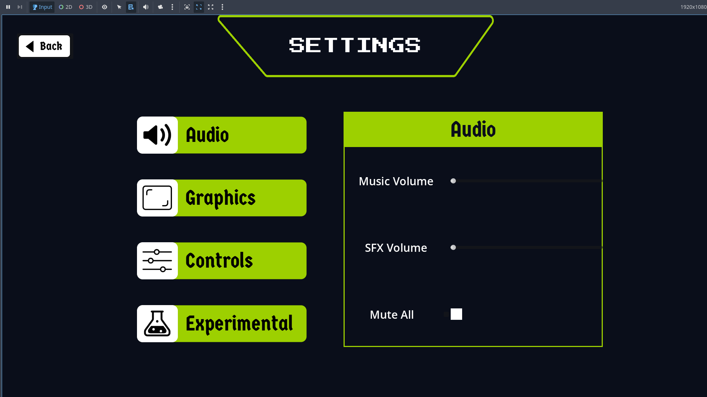
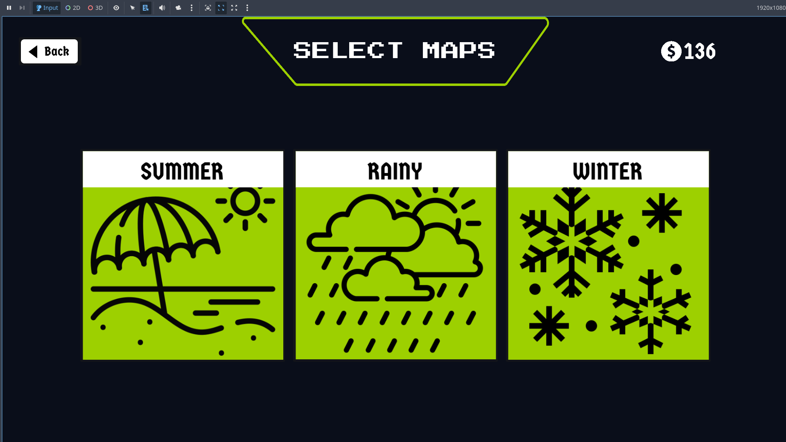
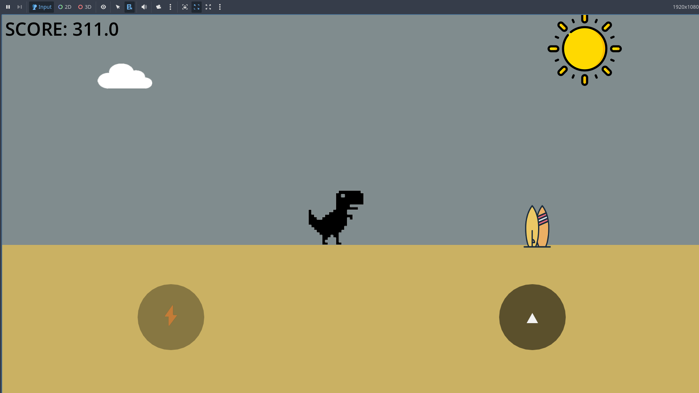

 
<h1 style="display: inline-block; vertical-align:middle;">Dino King</h1>

Dino King adalah game endless runner sederhana yang dirancang khusus untuk perangkat Mobile (Android).

Konsepnya simpel: Anda bermain sebagai dinosaurus yang berlari tanpa henti. Tugas Anda adalah bertahan hidup sejauh mungkin dari rintangan kaktus yang akan berubah-ubah menyesuaikan lokasi yang dipilih. Game ini dikembangkan sebagai fondasi untuk proyek yang lebih besar ke depannya.

**Cara Bermain**
Cukup tap layar (atau tekan tombol Segitiga) untuk melompat. Skor Anda akan otomatis dikonversi menjadi Koin dan tersimpan di memori HP.

**Teknologi**
Dibuat menggunakan Godot Engine 4.5 (Mobile Renderer) dengan bahasa GDScript. Semua aset visual menggunakan gaya Pixel Art custom.

### 🎨 Dokumentasi UI
Berikut adalah rancangan antarmuka asli dari proses pengembangan:

  
  
   
  
  
   
  

---
Credits: Muhammad Raid Zaidani (Developer), Syahril Rizky & Mufti Ali (Support).

[📜 Lihat Changelog](CHANGELOG.md) | [⚖️ Lihat Lisensi](LICENSE)

Licensed under the Apache License, Version 2.0. © 2026 Muhammad Raid Zaidani.
